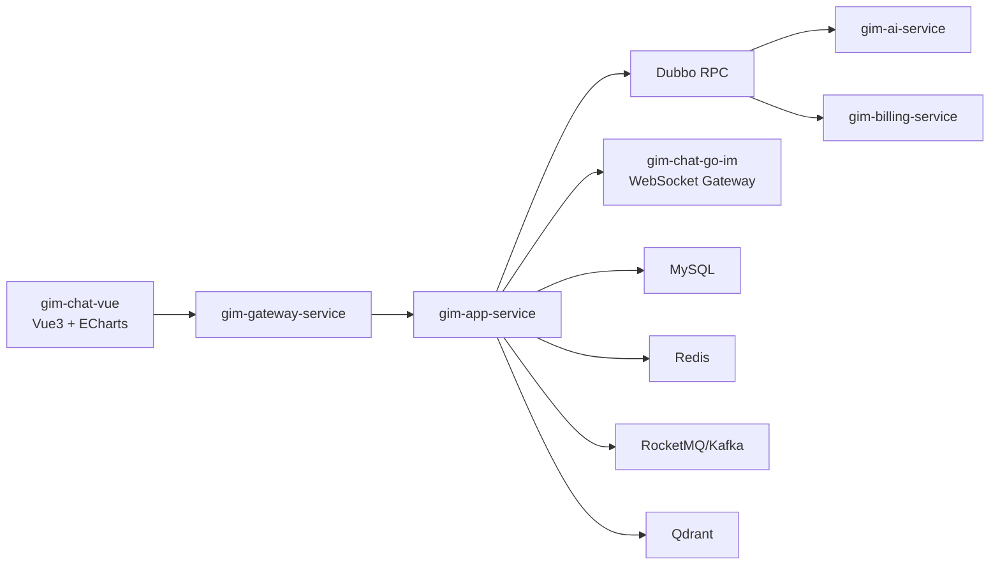

# 🚀 Gim-OmniFlow（全模态 AI 内容生产编排平台）


本项目是一款面向工业场景的全栈智能协作平台，集 **实时社交（IM）**、**云端协作（Drive）** 与 **多模态 AI（Intelligence）** 于一体。  
通过 AI 网关、RAG 知识增强、Agent 工作流与高并发消息系统，实现从“数据接入 -> 智能分析 -> 内容生成 -> 协同执行”的闭环。

---

## 🏗️ 核心架构与技术亮点

### 1. 统一 AI 服务网关（AI-Gateway）

- **统一入口**：AI 相关能力统一由网关层接入，支持鉴权、配额、日志审计和故障隔离。
- **多模型适配**：通过工厂模式适配 OpenAI、Gemini、DeepSeek、Kimi 等模型，实现模型快速切换。
- **策略化编排**：通过策略模式对不同模型的 Prompt、上下文和响应格式进行差异化处理。

### 2. 多模态 AI 工作流（Visual Workflow）

- **画布节点化编排**：通过画布节点方式完成任务搭建与执行，适配复杂 AI 生产链路。
- **节点能力覆盖**：支持 **文生图、图生图、图生视频、文生视频** 四类操作，可按节点自由组合。
- **异步解耦**：对长耗时任务采用消息队列解耦，保障高吞吐下的任务稳定执行。

### 3. 高并发与实时通信

- **高并发消息网关**：Go 实现 IM 网关，支持 WebSocket 双工通信和在线状态管理。
- **低延迟传输**：面向多人协作场景提供稳定的实时消息链路，支持高并发推送。
- **可扩展 RTC 演进**：预留音视频协作能力扩展路径（可平滑演进 SFU/WebRTC 架构）。

### 4. 智能知识库与 RAG 增强

- **企业级知识接入**：支持 PDF、Word、图片等多源文档上传、抽取、向量化入库。
- **RAG 强化问答**：对话时动态挂载知识库，构建业务私域“AI 大脑”，显著降低幻觉率。
- **Agent 协同**：结合任务型 Agent 工作流，支持跨工具和跨数据源的自动化协作。

### 5. 多模型接入与持续扩展

- **易扩展模型层**：通过统一模型接入层屏蔽不同厂商 API 差异，支持后续持续迭代扩容。
- **当前已接入模型**：ChatGPT、Gemini（Genmi）、DeepSeek、Kimi。
- **迭代友好**：新增模型时无需大规模改动业务层，降低迭代成本与接入风险。

### 6. Spring Stream 中间件抽象

- **统一消息编程模型**：引入 Spring Stream，业务代码面向统一接口开发，不直接耦合底层 MQ SDK。
- **屏蔽中间件差异**：可在 Kafka 与 RocketMQ 之间进行切换或并行演进，减少业务改造范围。
- **增强可维护性**：统一消息绑定、消费组与序列化策略，提升可观测性与治理一致性。

---

## 🛠️ 功能模块全景

| **模块**           | **核心功能**                       | **技术实现**                     |
| ------------------ | ---------------------------------- | -------------------------------- |
| **智能网盘**       | 文档存储、在线预览、权限控制       | SpringBoot + MySQL + OSS         |
| **AI 助手**        | 流式对话、多模型切换、附件解析     | LangChain4j + Spring AI          |
| **实时热榜**       | 聚合微博、抖音、知乎、网易热搜前十 | 爬虫引擎 + Redis 缓存 + 趋势分析 |
| **在线音视频通话** | 1v1、多人视频通话、屏幕共享        | Go + WebRTC  + WebSocket         |
| **工作流画布**     | 文/图/视频 跨模态生成流            | Vue-Flow / Vue/Axios             |
| **任务调度**       | XXL-Job                            | 分布式定时任务                   |
| **对象存储**       | MinIO                              | 图片/视频文件海量存储            |

---

## 📂 项目目录结构（Monorepo）

```text
Gim-OmniFlow/
|- gim-ai-server/                          # Spring Boot + Spring AI 后端主工程
|  |- gim-gateway-service/                 # API Gateway（统一入口）
|  |- gim-app-service/                     # 应用服务（业务 API + 编排）
|  |- gim-api-service/                     # Dubbo 接口契约层
|  |- gim-common-service/                  # 公共能力层
|  `- gim-business-service/
|     |- gim-ai-service/                   # AI 业务服务
|     |- gim-billing-service/              # 账务/积分服务
|     `- gim-all-service/                  # AI + Billing 聚合启动模块
|- gim-chat-go-im/                         # Go 高并发消息网关
|  |- config/                              # Redis/运行配置
|  |- internal/chat/hub/                   # WebSocket 连接与会话管理
|  |- internal/chat/repository/            # 消息与状态存储访问层
|  `- main.go                              # 服务入口（:9999）
`- gim-chat-vue/                           # Vue 前端（大屏 + 交互）
   |- src/views/                           # 页面视图
   |- src/components/                      # 公共组件
   |- src/router/                          # 路由层
   |- src/store/                           # 状态管理
   `- src/services/                        # API/业务调用封装
```

---

## 🧪 技术栈清单（带图标）

### 后端与 AI

-  `Java 17`
-  `Spring Boot`
-  `Spring AI / Agent Workflow`
-  `Spring Stream`
-  `Dubbo`
-  `LangChain4j`

### 实时通信与网关

-  `Go`
-  `WebSocket`
-  `Gin`

### 前端与可视化

-  `Vue 3`
-  `ECharts`
-  `Axios`

### 数据与中间件

-  `MySQL`
-  `Redis`
-  `Kafka / RocketMQ（由 Spring Stream 抽象）`
-  `Qdrant`
-  `Nacos`

---

## 🔭 系统架构简述



架构要点：

1. 前端通过网关统一进入后端服务，屏蔽内部服务拓扑。
2. 应用服务通过 Dubbo 调用 AI 与账务等能力服务，保持契约分层。
3. IM 网关独立于 Java 服务栈，承担高并发长连接与实时消息分发。

---

## ⚡ 本地开发快速启动

### 1) 环境准备

- `JDK 17+`
- `Maven 3.8+`
- `Go 1.22+`
- `Node.js 18+`
- `MySQL / Redis / Nacos / MQ / Qdrant`（按本地环境配置）

### 2) 启动后端（Java）

```bash
cd gim-ai-server
mvn -DskipTests install
```

可选方式 A：聚合启动（推荐本地联调）

```bash
mvn -DskipTests spring-boot:run -pl gim-business-service/gim-all-service
mvn -DskipTests spring-boot:run -pl gim-app-service
mvn -DskipTests spring-boot:run -pl gim-gateway-service
```

可选方式 B：拆分启动（接近生产拆分）

```bash
mvn -DskipTests spring-boot:run -pl gim-business-service/gim-ai-service
mvn -DskipTests spring-boot:run -pl gim-business-service/gim-billing-service
mvn -DskipTests spring-boot:run -pl gim-app-service
mvn -DskipTests spring-boot:run -pl gim-gateway-service
```

### 3) 启动消息网关（Go）

```bash
cd gim-chat-go-im
go mod tidy
go run main.go
```

健康检查：`http://localhost:9999/healthz`  
WebSocket：`ws://localhost:9999/chat/ws`

### 4) 启动前端（Vue）

```bash
cd gim-chat-vue
npm install
npm run serve
```

生产构建：

```bash
npm run build
```

---

## 🐳 Docker Compose（后端三服务）

仓库已提供 Java 后端三服务编排：

- `gim-ai-service`
- `gim-app-service`
- `gim-gateway-service`

启动：

```bash
cd gim-ai-server
docker compose up -d --build
```

常用命令：

```bash
docker compose logs -f gim-gateway-service
docker compose down
```

说明：

- 当前 compose 仅启动上述三个 Java 服务。
- 外部依赖需自行准备：`Nacos`、`MySQL`、`Redis`、`RocketMQ/Kafka`、`MinIO`、`Qdrant`。
- 生产部署前请将地址、账号、密钥迁移为环境变量管理。

---

## 🤝 面向开源社区

Gim-OmniFlow 适合作为以下能力的工程展示载体：

- 复杂业务域建模与分层架构设计
- AI 工程化落地（RAG + Agent + 多模型治理）
- 高并发消息系统与实时协同能力建设
- 工业可视化与数据产品化能力

欢迎提出 Issue、PR 或架构建议，一起将 Gim-OmniFlow 演进为更完整的工业级开源智能协作平台。
